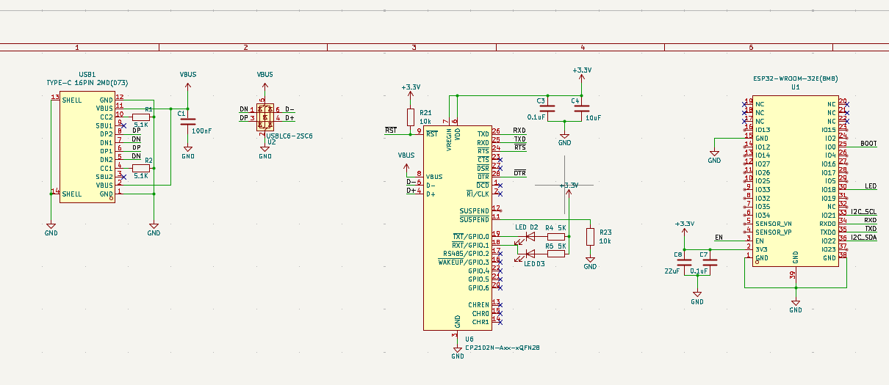
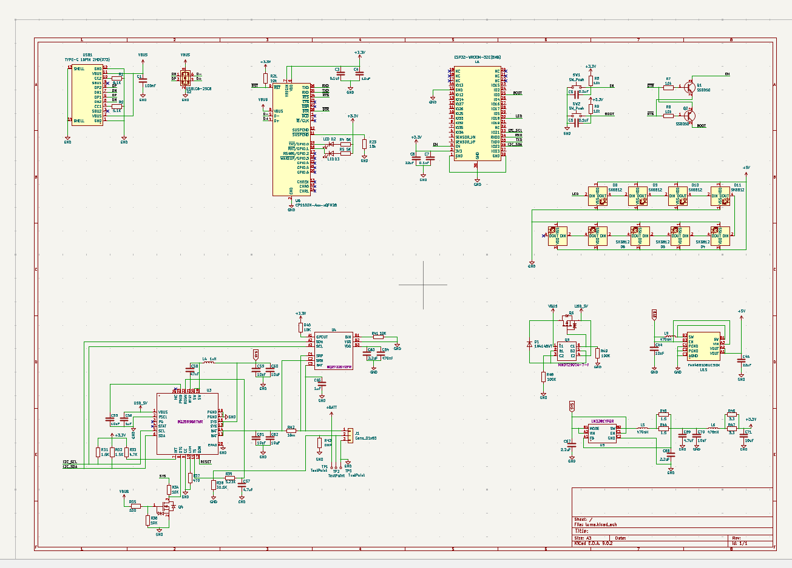

# July 16: Start and Schematic Design

I was scrolling TikTok out of boredom when I found a minecraft lantern that someone was selling and that could be controlled by an IR remote and in that moment I thought of a way to improve it so that's when Luma was started. I wanted to make a minecraft lantern that can be controlld by an app/bluetooth and that you can give to your friends to communicate through lights.

To do this I would need a chip that has bluetooth/wifi (I have designd my own before and would like to save myself the time lol) so I ended up using an ESP32-WROOM-32E(8MB) along with 9 LED's in a 3x3 matrix. I planned on having it be charged through USB-C and connect to a LiPo battery. I would make the case 3D-printeable and inclue acrylic panels with parchment paper to create a sort of "opacity". After having a clear idea of what I wanted to make, I started wiring up the components.

I started off with the ESP32 and the USB-C circuit bassed off of the application note before going to sleep.

**Time Spent:** 4 Hours

# July 17: Finish Schematic and PCB

After making part of the schematic I started work on the battery charging circuits, reusing a design that I implmented in my other project (Linea). Then I added the LED's and connected them to the ESP32.

After that I started wiring and grouping th components to organize the wiring and make it easier. I decided to make 2 ground planes for the fun of it and wire all the components on one side and then the LED's on the other. I planned on the board being on the bottom or top of the case so the LED's could illuminate the area well.
