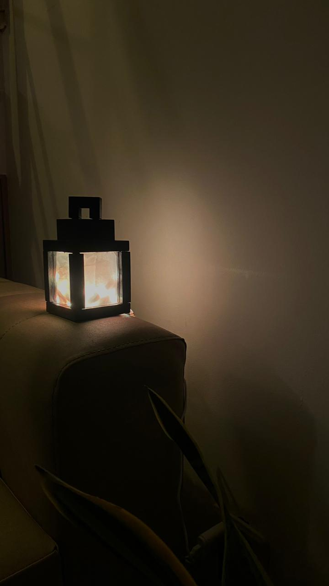
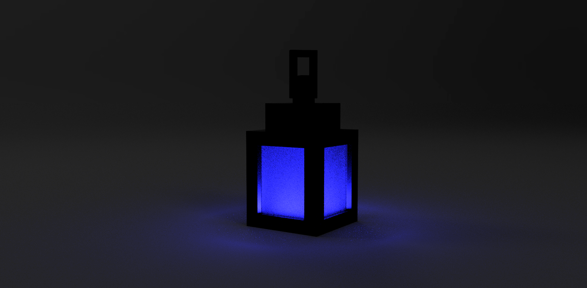
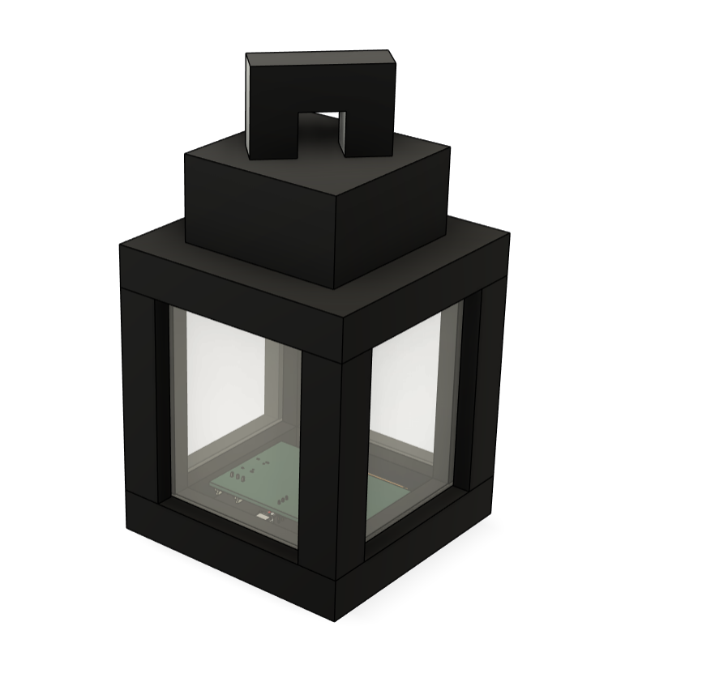
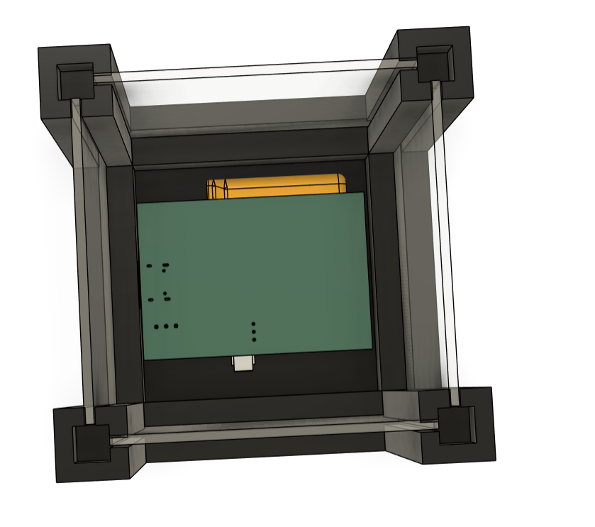
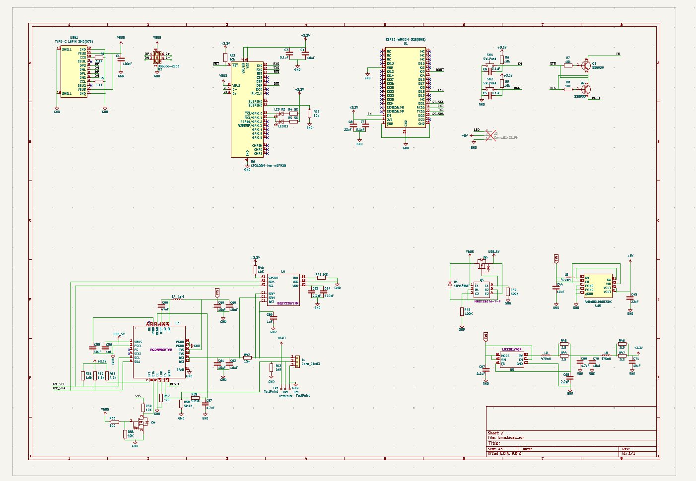
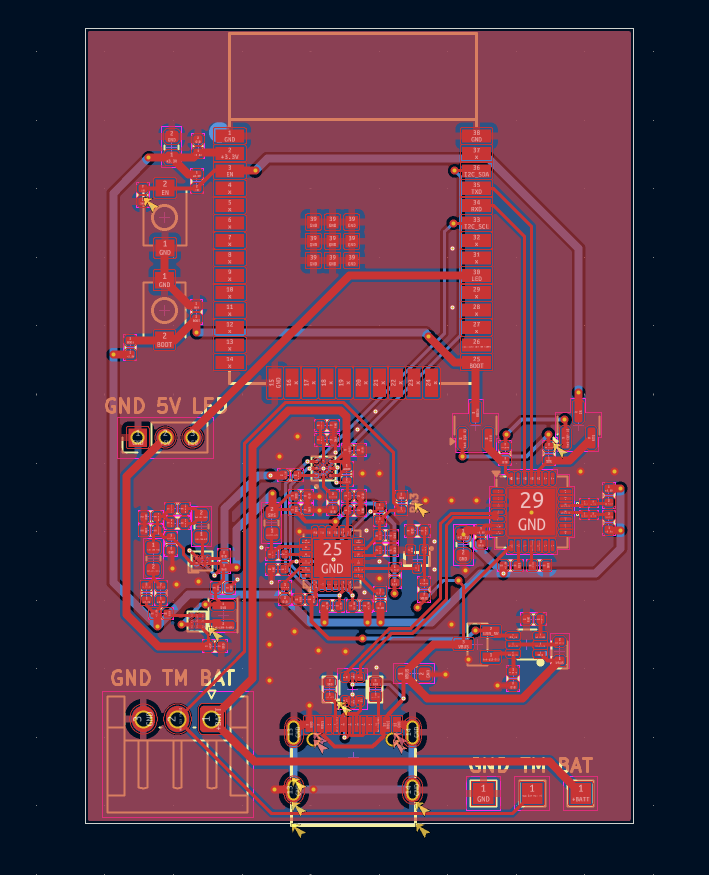
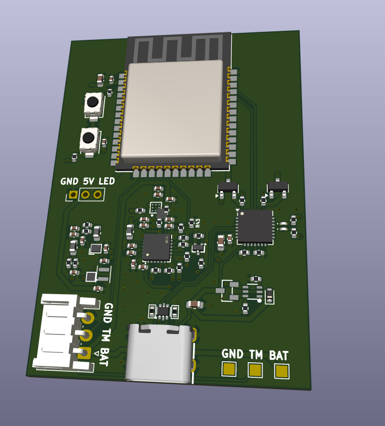
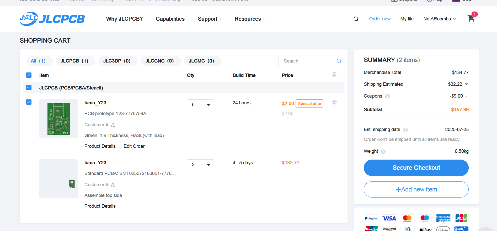

<h1 align="center">
   
  
   
  Luma
   
</h1>

<h4 align="center">
A Minecraft inspired lantern with bluetooth!

</h4>

  <a href="#key-features">Key Features</a> •
  <a href="#case-and-cad">Case & CAD</a> •
  <a href="#pcb">PCB</a> •
  <a href="#bom">BOM</a> •
  <a href="#credits">Credits</a> •
  <a href="#license">License</a>

## Key Features

- Bluetooth/Wifi capabilitis
- Bright configurable LED's
- Easy to assemble case
- App to control/change colors

## Case and CAD

The case includes:

- 3D printed parts: The base, walls, top, and chain
- Glueable inserts and acrylic panes

Designed in Fusion 360.

## PCB

Designed in KiCad. Notable points:

- ESP32-WROOM-32E for bluetooth support
- LiPo battery charging circuit
- USB-C
- LED Header to add custom LED's

### Main Board

## BOM

| Item             | Price (USD) | Source                                                                                                                                                                                                                                                                                                          |
| ---------------- | ----------- | --------------------------------------------------------------------------------------------------------------------------------------------------------------------------------------------------------------------------------------------------------------------------------------------------------------- |
| PCB              | 134.77      | JLCPCB                                                                                                                                                                                                                                                                                                          |
| 3D Printed Parts | 0.00        | (already have a 3D printer)                                                                                                                                                                                                                                                                                     |
| Acrylic Panes    | 0.00        | (already have)                                                                                                                                                                                                                                                                                                  |
| LED Strip        | 0.00        | (already have)                                                                                                                                                                                                                                                                                                  |
| LiPo 1200mAh     | 12.00       | [Online Marketplace (Aliexpress takes 1 month)](https://articulo.mercadolibre.com.co/MCO-897219547-bateria-37v-1200mah-litio-lipo-35-x-6cm-ancho-05cm-_JM#polycard_client=search-nordic&position=31&search_layout=stack&type=item&tracking_id=64c5a1d6-adab-4203-b581-c1839af5c176&wid=MCO897219547&sid=search) |
| **Total**        | 146.77      |                                                                                                                                                                                                                                                                                                                 |

## Credits

This project uses:

- [KiCad](https://www.kicad.org/)
- [VSCode](https://code.visualstudio.com/)
- [Fusion 360](https://www.autodesk.com/products/fusion-360/overview)

## You may also like...

- [Niveles De Niveles](https://github.com/NotARoomba/NivelesDeNiveles) – Real-time flood alert app
- [Linea](https://github.com/NotARoomba/Linea) – An EMR tablet
- [Tamaki](https://github.com/NotARoomba/Tamaki) – A cute HackPad

## License

MIT

---

> [notaroomba.dev](https://notaroomba.dev) &nbsp;&middot;&nbsp;
> GitHub [@NotARoomba](https://github.com/NotARoomba)
